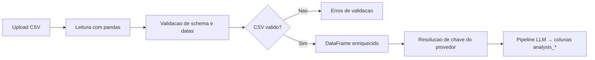
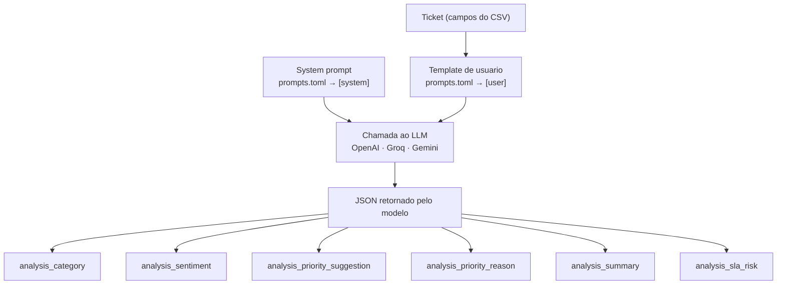

# Support Ticket Insight Lab

Aplicacao Python e Streamlit para validar e preparar tickets de suporte de infraestrutura a partir de um CSV enviado pelo usuario.

**App publicado:** [support-ticket-insight-lab.streamlit.app](https://support-ticket-insight-lab.streamlit.app/)

O projeto organiza a primeira etapa de um fluxo de inteligencia operacional para suporte: recebe uma base de tickets, valida o schema, separa tickets abertos e fechados, calcula idade ou tempo de resolucao e prepara colunas de analise para classificacao, sentimento, sugestao de prioridade, resumo e risco de SLA.

> **Nota de privacidade:** tickets de suporte podem conter dados pessoais, ativos internos e detalhes operacionais. Use arquivos anonimizados em ambientes publicos e configure chaves de provedores somente por variaveis de ambiente ou campos seguros da sessao.

## Visao geral

1. O usuario abre o app Streamlit e envia um arquivo CSV de tickets.
2. A aplicacao le o CSV enviado pelo usuario ou, quando ativado no sidebar, carrega a base sintetica `support_tickets_mock.csv`.
3. O validador confere as colunas obrigatorias e normaliza datas em UTC.
4. Tickets sem `closed_at` sao classificados como abertos e recebem `analysis_ticket_age_days`.
5. Tickets com `closed_at` recebem `analysis_resolution_time_days`.
6. Datas invalidas, `opened_at` vazio e `closed_at` anterior a `opened_at` interrompem o processamento com erro claro.
7. A interface resolve a chave do provedor selecionado por variavel de ambiente ou por campo seguro da sessao.
8. A camada de pipeline envia cada ticket ao provedor LLM e grava os resultados nas colunas `analysis_*`.



## O que foi implementado

| Area | Comportamento |
|---|---|
| Upload e leitura | App Streamlit aceita CSV enviado pelo usuario ou base sintetica local para testes. |
| Validacao de schema | Confere `ticket_id`, `title`, `description`, `opened_at`, `closed_at` e `priority`. |
| Tratamento de datas | Converte datas para UTC, rejeita valores invalidos e impede fechamento anterior a abertura. |
| Status analitico | Marca tickets como `open` ou `closed` em `analysis_status_type`. |
| Metricas temporais | Calcula idade para tickets abertos e tempo de resolucao para tickets fechados. |
| Provedores de IA | Analise ticket a ticket via OpenAI, Gemini ou Groq. Prompts configuraveis em `prompts.toml`. |
| Contrato do pipeline | Define resultado esperado para categoria, sentimento, prioridade sugerida, justificativa, resumo e risco de SLA. |
| Qualidade automatizada | CI executa Ruff, verificacao de formato, Pytest e compilacao do app Streamlit. |

## Stack

| Ferramenta | Uso no projeto |
|---|---|
| Python 3.11+ | Runtime principal. |
| Streamlit | Interface web para upload, validacao e configuracao do provedor. |
| pandas | Leitura, validacao e enriquecimento tabular dos tickets. |
| Pytest | Testes unitarios do validador, pipeline, exportacao, schema e configuracao. |
| Ruff | Lint e checagem de formato. |
| GitHub Actions | CI em push e pull request para `main`. |

## Schema do CSV

Colunas obrigatorias:

| Coluna | Tipo esperado | Descricao |
|---|---|---|
| `ticket_id` | texto | Identificador unico do ticket. |
| `title` | texto | Titulo ou assunto do ticket. |
| `description` | texto | Descricao principal da solicitacao ou incidente. |
| `opened_at` | data/datetime | Data de abertura do ticket. |
| `closed_at` | data/datetime/vazio | Data de fechamento. Valor vazio significa ticket aberto. |
| `priority` | texto | Prioridade original no sistema de origem. |

Colunas recomendadas:

```text
status, requester_department, requester_location, affected_service, asset_id,
assigned_team, assignee, channel, impact, urgency, resolution_notes
```

Exemplo minimo com dados sinteticos:

```csv
ticket_id,title,description,opened_at,closed_at,priority
INC-001,VPN indisponivel,Usuario nao consegue conectar a VPN,2026-05-01,,high
INC-002,Fila de impressao travada,Servico de impressao parado no andar 2,2026-05-01T10:00:00Z,2026-05-02T12:00:00Z,medium
```

## Configuracao de provedores

O app seleciona o provedor na interface, resolve a chave API e executa a analise ticket a ticket.

| Provedor | Variavel de ambiente |
|---|---|
| OpenAI | `OPENAI_API_KEY` |
| Gemini | `GEMINI_API_KEY` |
| Groq | `GROQ_API_KEY` |

Quando a variavel de ambiente do provedor selecionado existe, ela tem precedencia e a chave nao e exibida. Quando nao existe, a interface solicita a chave com `st.text_input(type="password")`. Chaves digitadas na interface ficam somente na sessao atual e nao sao gravadas em disco pelo projeto.

## Como o LLM analisa os tickets

Apos a validacao do CSV e o enriquecimento temporal, cada ticket e enviado individualmente ao provedor LLM configurado. O sistema monta um prompt com os campos do ticket, envia ao modelo e mapeia o JSON retornado para colunas `analysis_*` no DataFrame.

Os prompts — tanto o system prompt quanto o template de usuario — ficam em [`src/ticket_insight/prompts.toml`](src/ticket_insight/prompts.toml). Editar esse arquivo altera o comportamento da analise na proxima execucao, sem reiniciar o app.



### Campos gerados pelo LLM

| Coluna | Valores possíveis | Descrição |
|---|---|---|
| `analysis_category` | Rede, Hardware, Acesso, Software, … | Categoria do problema identificada pelo modelo. |
| `analysis_sentiment` | Positivo, Neutro, Negativo | Sentimento percebido na descricao do ticket. |
| `analysis_priority_suggestion` | Baixa, Media, Alta, Critica | Prioridade sugerida com base no contexto. |
| `analysis_priority_reason` | texto livre | Justificativa para a prioridade sugerida. |
| `analysis_summary` | texto livre | Resumo conciso do ticket gerado pelo modelo. |
| `analysis_sla_risk` | Baixo, Medio, Alto | Risco de violacao de SLA estimado pelo modelo. |

### Metadados do pipeline

| Coluna | Descrição |
|---|---|
| `analysis_provider` | Provedor utilizado na analise (`openai`, `groq` ou `gemini`). |
| `analysis_processed_at` | Timestamp UTC de quando a analise foi executada. |

### Campos temporais (preenchidos pelo validador antes da analise)

| Coluna | Descrição |
|---|---|
| `analysis_status_type` | `open` (sem `closed_at`) ou `closed`. |
| `analysis_ticket_age_days` | Dias desde `opened_at` para tickets abertos. |
| `analysis_resolution_time_days` | Dias de `opened_at` ate `closed_at` para tickets fechados. |

## Instalar e executar localmente

```bash
python3 -m venv .venv
source .venv/bin/activate
python3 -m pip install --upgrade pip
pip install -r requirements.txt
streamlit run app/app.py
```

Depois de abrir o app, envie um CSV com o schema obrigatorio. Sem upload, a aplicacao mostra apenas instrucoes e requisitos.

Para testar sem enviar arquivo, use a opcao **Usar dados mock** no sidebar. Ela carrega `support_tickets_mock.csv`, uma base sintetica versionada no repositorio.

## Testes e qualidade

```bash
ruff check .
ruff format --check .
pytest
PYTHONPATH=src:app python3 -m py_compile app/app.py
```

Os mesmos comandos rodam no GitHub Actions para pull requests e pushes na branch `main`.

## Estrutura do projeto

```text
support-ticket-insight-lab/
├─ app/
│  ├─ app.py
│  ├─ theme.py
│  └─ components/
│     ├─ charts.py
│     ├─ data_export.py
│     ├─ kpi_cards.py
│     ├─ sidebar.py
│     └─ uploader.py
├─ src/
│  └─ ticket_insight/
│     ├─ analyzer.py
│     ├─ config.py
│     ├─ pipeline.py
│     ├─ prompts.toml
│     ├─ providers.py
│     ├─ schema.py
│     └─ validator.py
├─ tests/
├─ .github/workflows/
├─ pyproject.toml
├─ requirements.txt
├─ support_tickets_mock.csv
└─ README.md
```

## Deploy no Streamlit Cloud

App publicado: [https://support-ticket-insight-lab.streamlit.app/](https://support-ticket-insight-lab.streamlit.app/)

1. Conecte este repositorio ao Streamlit Cloud.
2. Configure o arquivo principal como `app/app.py`.
3. Use `requirements.txt` para instalar as dependencias.
4. Configure secrets do Streamlit Cloud para `OPENAI_API_KEY`, `GEMINI_API_KEY` ou `GROQ_API_KEY`, conforme o provedor usado.

## Licenca

Distribuido sob a licenca MIT. Consulte `LICENSE` para mais detalhes.
