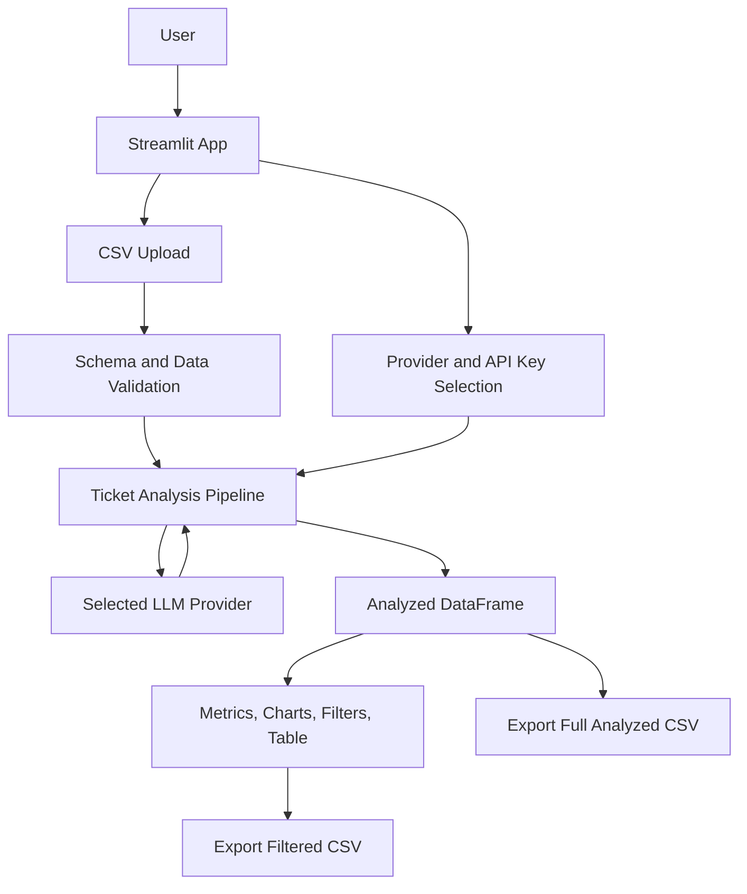
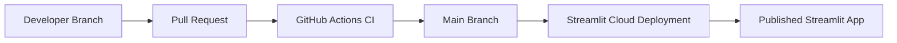

# Executive Summary

**Support Ticket Insight Lab** is a Python and Streamlit application for analyzing infrastructure support tickets from a user-uploaded CSV file. The product is designed for internal IT and infrastructure teams supporting a company of roughly **150 to 300 employees**.

The application will validate the uploaded CSV, classify each ticket, analyze sentiment, suggest or refine priority, generate a short operational summary, and present the results in a Streamlit dashboard. The same analyzed dataset can be exported back to CSV, including filtered exports such as only high-priority tickets or only open incidents.

The project must not include demo fallback data. The user may test the app with a mock CSV dataset, but the application itself must always require an uploaded CSV and must not silently substitute sample records.

The first product documentation and implementation should be written in English. The **README** and the **Streamlit user interface** must be in **Brazilian Portuguese (pt-BR)**.

## Product Goal

Build a practical internal IT analytics tool that helps infrastructure teams understand ticket volume, urgency, sentiment, recurring issues, and operational workload from CSV-based support data.

The application should answer questions such as:

- Which infrastructure areas generate the most tickets?
- How many tickets are open, closed, overdue, or high-priority?
- Which teams, locations, systems, or services are most affected?
- Which tickets should be handled first?
- What are the dominant themes and user sentiment patterns?

## Target Users

- **IT Infrastructure Analysts:** upload ticket exports, review enriched analysis, and export prioritized work queues.
- **IT Managers and Coordinators:** monitor operational trends, SLA pressure, recurring incidents, and priority distribution.
- **Support Operations Teams:** use the dashboard as a lightweight interface for ticket triage and reporting.

## Business Context

The ticket domain should focus on infrastructure support for a medium-sized company, including topics such as:

- Network connectivity, Wi-Fi, VPN, DNS, proxy, firewall, and internet access.
- Identity and access management, password resets, MFA, account lockouts, and permissions.
- Hardware issues with notebooks, desktops, monitors, printers, phones, and peripherals.
- Corporate systems access, email, collaboration tools, shared folders, and endpoint software.
- Security alerts, malware suspicion, phishing reports, device loss, and policy violations.
- Office infrastructure issues, meeting room equipment, badge/access systems, and local devices.

## MVP Scope

The MVP includes:

- CSV upload through Streamlit.
- Strict CSV schema validation with clear error messages.
- Required support for both open and closed tickets.
- Ticket classification by infrastructure category.
- Sentiment analysis.
- Priority suggestion based on ticket content, current priority, dates, status, business impact, and urgency signals.
- Short ticket summary.
- Streamlit dashboard with metrics, charts, filters, and analyzed ticket table.
- Export of analyzed CSV.
- Export with active filters applied, for example only critical priority tickets or only open tickets.
- Provider selection in the Streamlit interface.
- API key input in the Streamlit interface when no valid key is available through environment variables.
- Local environment variable support for users running the app locally.
- CI/CD through GitHub Actions.
- Deployment through Streamlit Cloud.
- Tests for CSV validation, processing, filtering, export, and key dashboard data transformations.

The MVP does not include:

- Mock or fallback application data.
- RAG, embeddings, semantic search, or vector databases.
- Dockerfile or Docker Compose.
- Python package distribution or publishable package setup.
- CLI as a primary interface.
- API contracts or endpoint examples in the PRD.
- Example input CSV or example output result inside this document.

## CSV Data Schema

The uploaded CSV must describe support tickets. The app should validate required columns and tolerate optional columns when available.

### Required Columns

| Column | Type | Description |
|---|---:|---|
| `ticket_id` | string | Unique ticket identifier. |
| `title` | string | Short ticket title or subject. |
| `description` | string | Main ticket text, request, incident description, or user message. |
| `opened_at` | date/datetime | Ticket opening date. |
| `closed_at` | date/datetime/null | Ticket closing date. Empty value means the ticket is still open. |
| `priority` | string | Original priority from the source system. |

### Recommended Columns

| Column | Type | Description |
|---|---:|---|
| `status` | string | Current status, such as open, in progress, waiting, resolved, or closed. |
| `requester_department` | string | Department of the employee who opened the ticket. |
| `requester_location` | string | Office, city, floor, branch, or remote location. |
| `affected_service` | string | Infrastructure service affected, such as VPN, Wi-Fi, email, device, identity, printer, or shared folder. |
| `asset_id` | string | Device, workstation, printer, or asset identifier. |
| `assigned_team` | string | Team or squad responsible for handling the ticket. |
| `assignee` | string | Analyst assigned to the ticket. |
| `channel` | string | Source channel, such as portal, email, phone, Teams, Slack, or walk-in. |
| `impact` | string | Business impact level or affected audience. |
| `urgency` | string | Urgency level from the ticketing system. |
| `resolution_notes` | string | Closing note or resolution details when available. |

### Date Handling

The application must handle both ticket states:

- **Open tickets:** `closed_at` is empty or null. The app calculates age from `opened_at` to the current processing date.
- **Closed tickets:** `closed_at` is populated. The app calculates resolution time from `opened_at` to `closed_at`.

Invalid dates, closing dates before opening dates, and missing required dates should produce clear validation feedback.

### Output Columns

The enriched CSV should preserve the original columns and add analysis columns:

| Column | Description |
|---|---|
| `analysis_category` | Infrastructure category inferred from the ticket. |
| `analysis_sentiment` | Sentiment classification such as positive, neutral, negative, or very negative. |
| `analysis_priority_suggestion` | Suggested priority after analysis. |
| `analysis_priority_reason` | Short reason for the suggested priority. |
| `analysis_summary` | Short operational summary of the ticket. |
| `analysis_status_type` | Normalized state, such as open or closed. |
| `analysis_ticket_age_days` | Age in days for open tickets. |
| `analysis_resolution_time_days` | Resolution time in days for closed tickets. |
| `analysis_sla_risk` | SLA or operational risk indicator when calculable. |
| `analysis_provider` | Provider used for the analysis. |
| `analysis_processed_at` | Timestamp when the analysis was generated. |

## Streamlit Dashboard

The Streamlit application is the main user interface. It must be written in pt-BR and include:

- CSV upload area.
- CSV schema validation result.
- Provider selector.
- API key input when the selected provider has no key available in environment variables.
- Processing action.
- KPI cards for total tickets, open tickets, closed tickets, high-priority tickets, average age, and average resolution time.
- Charts for category distribution, priority distribution, sentiment distribution, status distribution, tickets over time, and aging/resolution time.
- Filters for priority, status, category, sentiment, affected service, department, location, assigned team, and date ranges.
- Analyzed ticket table.
- CSV export for the complete analyzed dataset.
- CSV export for the currently filtered dataset.

The app must not display mock records, sample fallback tickets, or generated demo data. If no CSV is uploaded, it should show upload instructions and schema requirements only.

## Provider and API Key Configuration

The app should support multiple LLM providers for classification, sentiment analysis, priority suggestion, and summary generation. The exact provider list can evolve, but the interface must allow selecting a provider.

Configuration behavior:

- If the selected provider has a valid API key available through environment variables, the app uses it.
- If no API key is available in environment variables, the Streamlit interface presents a secure API key input field.
- API keys entered through the web interface are used only for the current Streamlit session and must not be written to disk.
- Missing API keys must stop processing with a clear user-facing message.
- The app must not fall back to mock analysis when a provider is unavailable.

Environment setup should be documented in the README, not in this PRD. This document intentionally does not include example environment files or configuration examples.

## System Architecture



### Main Components

- **Streamlit App:** Uploads CSV, collects provider settings, shows dashboard, applies filters, and exposes export actions.
- **CSV Validator:** Validates required columns, date formats, open/closed ticket handling, and priority values.
- **Analysis Pipeline:** Coordinates classification, sentiment analysis, priority suggestion, summaries, and calculated operational fields.
- **Provider Client:** Sends only the necessary ticket fields to the selected LLM provider and normalizes responses.
- **Dashboard Layer:** Computes KPIs and visualizations from the analyzed DataFrame.
- **Exporter:** Produces full or filtered CSV exports.

## Repository Structure

```plaintext
support-ticket-insight-lab/
├─ app/
│  └─ streamlit_app.py
├─ src/
│  └─ ticket_insight/
│     ├─ __init__.py
│     ├─ config.py
│     ├─ schema.py
│     ├─ loader.py
│     ├─ validator.py
│     ├─ pipeline.py
│     ├─ providers.py
│     ├─ classifier.py
│     ├─ sentiment.py
│     ├─ priority.py
│     ├─ summarizer.py
│     ├─ metrics.py
│     └─ exporter.py
├─ tests/
│  ├─ test_schema.py
│  ├─ test_validator.py
│  ├─ test_pipeline.py
│  ├─ test_metrics.py
│  └─ test_exporter.py
├─ .github/
│  └─ workflows/
│     ├─ ci.yml
│     └─ streamlit-cloud-check.yml
├─ README.md
├─ requirements.txt
├─ action_plan.md
└─ resumo_executivo.md
```

No package distribution setup is required. Dependencies can be managed through `requirements.txt`, aligned with Streamlit Cloud deployment.

## CI/CD

### Continuous Integration

GitHub Actions should run on pull requests and pushes to the main branch:

- Install Python dependencies from `requirements.txt`.
- Run lint checks.
- Run formatting checks.
- Run unit tests.
- Run lightweight import checks for the Streamlit app.

### Continuous Delivery

Deployment is handled by Streamlit Cloud connected to the GitHub repository.

The deployment architecture should be:



Streamlit Cloud secrets should be used for production API keys when needed. Local users can configure environment variables or enter API keys in the web interface for their current session.

## GitHub Project Management

Detailed development tasks should not live in the PRD. A separate `action_plan.md` file should define only the initial execution plan and the GitHub Projects structure.

The actual task backlog must be managed in **GitHub Projects** using a Kanban-style board with:

- Cycles or milestones for staged delivery.
- Modules such as data ingestion, validation, LLM providers, analysis pipeline, dashboard, export, tests, CI/CD, documentation, and deployment.
- Labels for priority, type, module, risk, and status.
- Cards linked to GitHub issues.

The initial plan file should focus on bootstrapping tasks such as creating the folder structure, README, requirements file, first Streamlit app shell, validation module, and CI workflow.

## Testing Strategy

Tests should cover:

- CSV schema validation.
- Required columns.
- Open and closed ticket date handling.
- Invalid dates and invalid close-before-open cases.
- Priority normalization.
- Provider configuration behavior when API keys are missing.
- Analysis pipeline output schema.
- Dashboard metric transformations.
- Filter behavior.
- Full and filtered CSV export.

Tests must not rely on live LLM calls by default. Provider integrations should be isolated behind interfaces so tests can validate request/response normalization without calling external services.

## Security and Privacy

- API keys must never be committed.
- API keys entered in Streamlit must stay in session state only.
- The application should send only necessary ticket fields to the selected provider.
- Users should be warned before processing CSVs that may contain sensitive personal information.
- Logs must not include API keys or full sensitive ticket contents.
- Exported CSV files are user-controlled outputs and should preserve original data plus added analysis columns.

## Acceptance Criteria

- The app requires a user-uploaded CSV and does not display or process fallback mock data.
- The CSV validator requires `ticket_id`, `title`, `description`, `opened_at`, `closed_at`, and `priority`.
- Empty `closed_at` values are handled as open tickets.
- Populated `closed_at` values are handled as closed tickets.
- Ticket age and resolution time are calculated correctly for open and closed tickets.
- The app supports provider selection and API key entry in Streamlit when no environment key is available.
- Missing API keys stop processing with a clear message instead of using mock output.
- The dashboard shows operational metrics, charts, filters, and an analyzed ticket table.
- The user can export the full analyzed CSV.
- The user can export the filtered analyzed CSV.
- The README and Streamlit interface are written in pt-BR.
- The product documentation and code-facing requirements are written first in English.
- CI runs lint, formatting checks, and automated tests.
- The deployment target is Streamlit Cloud.
- The project does not include RAG, Dockerfile, API contract examples, environment examples in this PRD, package publishing, or embedded CSV/result examples.
